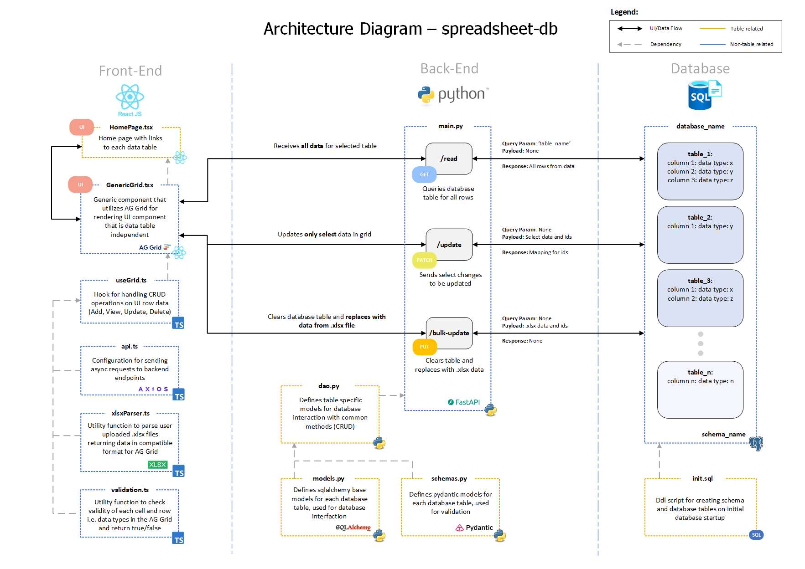

# spreadsheet-db

An application allowing users to perform CRUD (Create, Read, Update, and Delete) operations on relational database tables through an excel-like user interface


Stack:
- Frontend: React.js
    - Noteable packages: AG Grid
- Backend: Python
    - Noteable packages: FastAPI, SQLAlchemy, Pydantic
- Database: PostresSQL


CI/CD:
- Github Actions
- ArgoCD


Deployment:
- Kubernetes


# High-level Architecture




# Local Deployment

Requirements: 
- Install Docker Desktop (https://www.docker.com/products/docker-desktop/)


Step 1:
- Update spreadsheet-db/setup/schema.json file with desired table structure
    - Notes:
        - Must have "id" column with data_type "int_id" for each table
        - Currently only supports a single schema
        - Fields 'schema_name' and 'column_name' must use '_' if spacing is required
        - Current 'data_type' options: 'int_id', 'int', 'float', 'str', 'bool', 'date', 'datetime'
        - All naming conventions should be lowercase as seen in example


Example: 
```
{
    "schema_name": "test_schema",
    "tables": [
        {
            "table_name": "table_one",
            "columns": [
                {
                    "column_name": "id",
                    "data_type": "int_id"
                },
                {
                    "column_name": "name",
                    "data_type": "str"
                },
                {
                    "column_name": "description",
                    "data_type": "str"
                }
            ]
        },
        {
            "table_name": "table_two",
            "columns": [
                {
                    "column_name": "id",
                    "data_type": "int_id"
                },
                {
                    "column_name": "title",
                    "data_type": "str"
                },
                {
                    "column_name": "details",
                    "data_type": "str"
                },
                {
                    "column_name": "category",
                    "data_type": "str"
                }
            ]
        }
    ]
}
```
    

Step 2:
- cd into spreadsheet-db/setup folder and run the following command:
    - Notes: 
        - This will build all Frontend, Backend, and Database files based off of the schema.json input
        - Do not proceed to Step 3: until container creates and exits successfully
        - If you are using Windows, make sure that default EOL for .sh files it set to LF


```
docker compose build --no-cache
```

```
docker compose up -d
```


Step 3: 
- cd into spreadsheet-db root directory and run the following commands:

```
docker compose build --no-cache
```

```
docker compose up -d
```


Step 4: 
- Navigate to [localhost:3000](http://localhost:3000)


Optional:
- To stop and clear database volume for the application run the following in the spreadsheet-db root directory:

```
docker compose down -v
```

Sample Data:
- Sample data is provided in the spreadsheet-db/setup/data folder
    - Notes:
        - Data must be in .xlsx format and headers must match table columns that are defined in the schema.json file


# Roadmap
## Phase 1:

Goal: Basic functionality


Stage: POC (Proof of Concept) - The app will be considered POC after this phase. Breaking changes are expected and more frequent during this phase. Unit test coverage is recommended, but there are no coverage requirements.


- [x] Frontend:
    - [x] Common component for displaying/editing database tables utilizing backend endpoints in excel-like grid format
    - [x] Import .xlsx feature to bulk update database tables
    - [x] Data type validation
    - [x] Basic logging
    - [x] Dockerfile
- [x] Backend: 
    - [x] FastAPI with endpoints for /read, /update, and /bulk-update applicable to all tables
    - [x] Data type validation
    - [x] Basic logging
    - [x] Dockerfile
- [x] Database: 
    - [x] Basic Postgresql local setup with initialization .sql script
- [x] Setup:
    - [x] Makefile and .sh script files for dynamically generating Frontend, Backend, Database files at project start up
- [x] Local Testing:
    - [x] Setup docker-compose for local testing
- [x] CI/CD: No requirements
- [x] Deployment: No requirements
- [x] General: No requirements

- [x] Evaluation of POC:
    - Large data tables may experience slow bulk update and read times 
        - Tested with 150k row data, xlsx import / UI render (3s), update (negligible), bulk update (60s), read (10s)
    - Works only for a single schema that will contain all tables
    - Only PostgresSQL database type has been tested
    - Dockerfiles and docker-compose.yml are not automated by Makefile setup


## Phase 2:

Goal: Bug fixes, code refactoring, and optimizations


Stage: UAT (User Acceptance Testing) / Refactoring - Breaking changes are expected, but less frequent during this phase. Unit test coverage is recommended, but there are no coverage requirements.


- [x] Frontend:
    - [x] useGrid.ts - update handleUpdate bulkUpdateData case to predict backend ids after update (i.e. start from id=1 always since we will reset id count for the table), this will improve bulk update performance
    - [x] General - Add navigation bar with custom asset symbol and version number
    - [x] General - Incorporate links into navigation bar, main side link "Tables" with dropdown for table list
    - [x] useGrid.ts - Light cleanup of UI and styling
    - [x] General - Display count of row entries under the AG Grid component
    - [x] General - Fix bug where if bulk-update fails the Add Row and Remove Row buttons are still greyed out
    - [x] General - Fix bug where if blank rows are added and update is selected, they remain rendered
    - [x] General - Add tab selection indicator i.e underline or bold
    - [x] General - Adjust height flex for TablePage.tsx and HomePage.tsx
    - [x] General - Replace React App and logo with spreadsheet-db
- [ ] Backend:
    - [x] main.py - Change /read to a GET request instead of POST and pass table_name as parameter
    - [x] main.py - Change /update to a PATCH request instead of POST since is a partial update
    - [x] main.py - Change /bulk-update to a PUT request instead of POST since is a full update
    - [ ] main.py - Fix bug where if in middle of /bulk-update or /read and exit page request continues
    - [ ] main.py - For bulk-update need to reset ids after database table is cleared, but this syntax is database dependent (i.e. postgres .vs MSSQL, so need have a mapping for this)

- [x] Database: No Requirements
- [ ] Setup:
    - [ ] Update .sh files to incorporate any Frontend/Backend changes, may need to put the ID reset as part of shell script by
passing the database type and then using the correct query statement in dao.py
- [ ] Local Testing:
    - [ ] Combine setup and build phases into a single docker-compose
- [x] CI/CD: No requirements
- [x] Deployment: No requirements
- [x] General: 
    - [x] High-level architecture diagram
    - [x] Update sample.gif demo

- [ ] Evaluation of UAT / Refactoring:
    - Works only for a single schema that will contain all tables
    - Only PostgresSQL database type has been tested
    - Dockerfiles and docker-compose.yml are not automated by Makefile setup


## Phase 3: 

Goal: Initial release


Stage: Version 1.0 - The app with be considered Version 1.0 after this phase. Breaking changes are not expected during this phase, but bugs will recorded to resolve. Unit test coverage is required (80%) for Frontend and Backend.


- [ ] Frontend:
    - [ ] General - Unit tests
- [ ] Backend:
    - [ ] General - Unit tests 
- [ ] Database:
- [ ] Setup:
- [ ] Local Testing:
- [ ] CI/CD: 
    - [ ] General - Automated docker image build and push to Dockerhub in CI pipeline
    - [ ] General - Unit tests for Frontend and Backend in CI pipeline
- [ ] Deployment:
    - [ ] General - Helm chart for Kubernetes deployment
- [ ] General:
    - [ ] General - Update README.md with deployment instructions


- [ ] Evaluation of Version 1.0:


## Backlog / Future Considerations: 

- [ ] Frontend:
    - [ ] gridInterfaces.ts - Update RowData interface from 'any' to possible schemas for each table
    - [ ] apiInterfaces.ts - Update interfaces from 'any' to possible schemas for each table
    - [ ] useGrid.ts - Change alert statements to Material UI modals 
- [ ] Backend:
    - [ ] dao.py - Implement custom DAO (Data Access Object) for each data table 
    - [ ] main.py - Update cors middleware for production environment to address security concerns
    - [ ] main.py - Create schema for response of each endpoint (i.e. /read and /update since they return data)
    - [ ] main.py - Troubleshoot issues with from_orm sqlalchemy does not work
- [ ] Database:
- [ ] Setup:
    - [ ] General - Allow for multiple schemas
    - [ ] General - Add setup instructions for MSSQL / other relational database type
- [ ] Local Testing:
- [ ] CI/CD: 
- [ ] Deployment:
- [ ] General:
    - [ ] General - Test for MSSQL / other relational database type