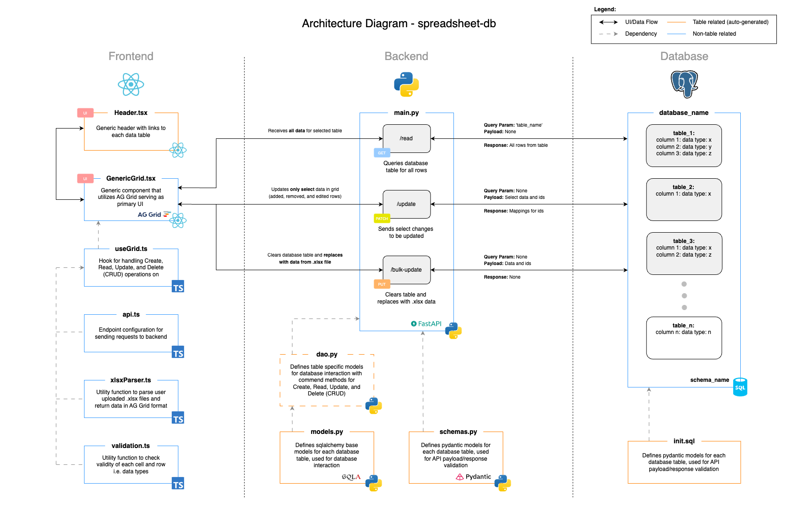

<!-- PROJECT STATS -->
<a name="readme-top"></a>

[![Contributors][contributors-shield]][contributors-url]
[![Forks][forks-shield]][forks-url]
[![Stargazers][stars-shield]][stars-url]
[![Issues][issues-shield]][issues-url]
[![Coverage Status][coverage-shield]][coverage-url]

<!-- PROJECT LOGO -->
<br />
<div align="center">
  <a href="https://github.com/cstrab/spreadsheet-db">
    
  </a>

<h3 align="center">spreadsheet-db</h3>

  <p align="center">
    An application allowing users to perform CRUD (Create, Read, Update, and Delete) operations on relational database tables through an excel-like user interface.
    <br />
    <a href="https://github.com/cstrab/spreadsheet-db/issues/new?labels=bug&template=bug-report---.md">Report Bug</a>
    ·
    <a href="https://github.com/cstrab/spreadsheet-db/issues/new?labels=enhancement&template=feature-request---.md">Request Feature</a>
  </p>
</div>


<!-- TABLE OF CONTENTS -->
<details>
  <summary>Table of Contents</summary>
  <ol>
    <li>
      <a href="#about-the-project">About The Project</a>
      <ul>
        <li><a href="#built-with">Built With</a></li>
        <li><a href="#high-level-architecture">High Level Architecture</a></li>
      </ul>
    </li>
    <li>
      <a href="#getting-started">Getting Started</a>
      <ul>
        <li><a href="#prerequisites">Prerequisites</a></li>
        <li><a href="#installation">Installation</a></li>
      </ul>
    </li>
    <li><a href="#usage">Usage</a></li>
    <li><a href="#roadmap">Roadmap</a></li>
    <li><a href="#contributing">Contributing</a></li>
    <li><a href="#license">License</a></li>
    <li><a href="#contact">Contact</a></li>
    <li><a href="#acknowledgments">Acknowledgments</a></li>
  </ol>
</details>


<!-- ABOUT THE PROJECT -->
## About The Project


spreadsheet-db allows users to manage relational databases through an excel-like user interface. Core functionalities include basic CRUD operations, bulk uploads from .xlsx files, and grid filtering.

<p align="right">(<a href="#readme-top">back to top</a>)</p>


### Built With

* [![React][react.js]][react-url]
* [![Python][python]][python-url]
* [![Postgres][postgres]][postgres-url]

<p align="right">(<a href="#readme-top">back to top</a>)</p>

### High Level Architecture



<p align="right">(<a href="#readme-top">back to top</a>)</p>


<!-- GETTING STARTED -->
## Getting Started

The following sections cover installation instructions using Docker Compose

### Prerequisites

1. Docker
2. Docker Compose

### Installation

#### Using Sample Tables

1. Clone the repository
   ```sh
   git clone https://github.com/cstrab/spreadsheet-db.git
   ```
2. Build and start project
   ```sh
   docker compose up -d
   ``` 
3. Navigate to [localhost:3000](http://localhost:3000)
* Note: Sample data is provided in the spreadsheet-db/setup/data folder for testing file upload

#### Using User Defined Tables (Templating for new project)

1. Repeat step 1. above
2. Update spreadsheet/setup/schema.json file with desired 'schema_name" and 'tables':
* Restrictions: 
    - Only supports a single schema
    - Each table must have 'id' column with data_type 'int_id'
    - Use '_' where spacing is required
    - Keep naming convention lowercase
    - Available 'data_type' options: 'int_id', 'int', 'float', 'str', 'bool', 'date', 'datetime'

Example: 
```
{
    "database_type": "postgresql",
    "schema_name": "test_schema",
    "tables": [
        {
            "table_name": "table_one",
            "columns": [
                {
                    "column_name": "id",
                    "data_type": "int_id"
                },
                {
                    "column_name": "name",
                    "data_type": "str"
                },
                {
                    "column_name": "description",
                    "data_type": "str"
                }
            ]
        },
        {
            "table_name": "table_two",
            "columns": [
                {
                    "column_name": "id",
                    "data_type": "int_id"
                },
                {
                    "column_name": "title",
                    "data_type": "str"
                },
                {
                    "column_name": "details",
                    "data_type": "str"
                },
                {
                    "column_name": "category",
                    "data_type": "str"
                }
            ]
        }
    ]
}
```

3. Rebuild schema dependent files
* Restrictions
   - Do not proceed to Step 4: until container creates and exits successfully
   - If you are using Windows, make sure that default EOL for .sh files it set to LF
   ```sh
   cd setup && docker compose build && docker compose up -d
   ```
4. Build and start project
   ```sh
   cd ../ && docker compose build && docker compose up -d
   ``` 
5. Navigate to [localhost:3000](http://localhost:3000)

<p align="right">(<a href="#readme-top">back to top</a>)</p>


<!-- USAGE EXAMPLES -->
## Usage

* Data Management UI

<p align="right">(<a href="#readme-top">back to top</a>)</p>


<!-- ROADMAP -->
## Roadmap

### Phase 1:

Goal: Basic functionality


Stage: POC (Proof of Concept) - The app will be considered POC after this phase. Breaking changes are expected and more frequent during this phase. Unit test coverage is recommended, but there are no coverage requirements.


- [x] Frontend:
    - [x] Common component for displaying/editing database tables utilizing backend endpoints in excel-like grid format
    - [x] Import .xlsx feature to bulk update database tables
    - [x] Data type validation
    - [x] Basic logging
    - [x] Dockerfile
- [x] Backend: 
    - [x] FastAPI with endpoints for /read, /update, and /bulk-update applicable to all tables
    - [x] Data type validation
    - [x] Basic logging
    - [x] Dockerfile
- [x] Database: 
    - [x] Basic Postgresql local setup with initialization .sql script
- [x] Setup:
    - [x] Makefile and .sh script files for dynamically generating Frontend, Backend, Database files at project start up
- [x] Local Testing:
    - [x] Setup docker-compose for local testing
- [x] CI/CD: No requirements
- [x] Deployment: No requirements
- [x] General: No requirements

- [x] Evaluation of POC:
    - Large data tables may experience slow bulk update and read times 
        - Tested with 150k row data, xlsx import / UI render (3s), update (negligible), bulk update (60s), read (10s)
    - Works only for a single schema that will contain all tables
    - Only PostgresSQL database type has been tested
    - Dockerfiles and docker-compose.yml are not automated by Makefile setup

<p align="right">(<a href="#readme-top">back to top</a>)</p>

### Phase 2:

Goal: Bug fixes, code refactoring, and optimizations


Stage: UAT (User Acceptance Testing) / Refactoring - Breaking changes are expected, but less frequent during this phase. Unit test coverage is recommended, but there are no coverage requirements.


- [x] Frontend:
    - [x] useGrid.ts - update handleUpdate bulkUpdateData case to predict backend ids after update (i.e. start from id=1 always since we will reset id count for the table), this will improve bulk update performance
    - [x] General - Add navigation bar with custom asset symbol and version number
    - [x] General - Incorporate links into navigation bar, main side link "Tables" with dropdown for table list
    - [x] useGrid.ts - Light cleanup of UI and styling
    - [x] General - Display count of row entries under the AG Grid component
    - [x] General - Fix bug where if bulk-update fails the Add Row and Remove Row buttons are still greyed out
    - [x] General - Fix bug where if blank rows are added and update is selected, they remain rendered
    - [x] General - Add tab selection indicator i.e underline or bold
    - [x] General - Adjust height flex for TablePage.tsx and HomePage.tsx
    - [x] General - Replace React App and logo with spreadsheet-db
    - [x] useGrid.ts - Fix bug where if changing from table to table isLoading=true is not set
    - [x] General - Autosort rows by id column
    - [x] useGrid.ts - Modal to prevent updates from user if any false in validation column when update pressed
- [ ] Backend:
    - [x] main.py - Change /read to a GET request instead of POST and pass table_name as parameter
    - [x] main.py - Change /update to a PATCH request instead of POST since is a partial update
    - [x] main.py - Change /bulk-update to a PUT request instead of POST since is a full update
    - [x] main.py - Implement request cancel if user exits page while endpoint is still processing
    - [x] main.py - For bulk-update add reset for ids after database table is cleared
    
- [x] Database: No Requirements
- [x] Setup:
    - [x] Update .sh files to incorporate any Frontend/Backend changes
- [x] Local Testing:
- [x] CI/CD: No requirements
- [x] Deployment: No requirements
- [x] General: 
    - [x] High-level architecture diagram
    - [x] Update sample.gif demo

- [x] Evaluation of UAT / Refactoring:
    - Works only for a single schema that will contain all tables
    - Only PostgresSQL database type has been tested, functionality for MSSQL available but not tested
    - Dockerfiles and docker-compose.yml are not automated by Makefile setup

<p align="right">(<a href="#readme-top">back to top</a>)</p>

### Phase 3: 

Goal: Initial release


Stage: Version 1.0 - The app with be considered Version 1.0 after this phase. Breaking changes are not expected during this phase, but bugs will recorded to resolve. Unit test coverage is required (80%) for Frontend and Backend.


- [x] Frontend:
    - [x] General - Unit tests
- [x] Backend:
    - [x] General - Unit tests 
- [x] Database:
- [x] Setup:
- [x] Local Testing:
- [x] CI/CD: 
    - [x] General - Unit tests for Frontend and Backend in CI pipeline 
    - [ ] General - Automated docker image build and push to Dockerhub in CI pipeline
- [ ] Deployment:
    - [ ] General - Helm chart for Kubernetes deployment
- [ ] General:
    - [ ] General - Update README.md with deployment instructions


- [ ] Evaluation of Version 1.0:

<p align="right">(<a href="#readme-top">back to top</a>)</p>

### Backlog / Future Considerations: 

- [ ] Frontend:
    - [ ] gridInterfaces.ts - Update RowData interface from 'any' to possible schemas for each table
    - [ ] apiInterfaces.ts - Update interfaces from 'any' to possible schemas for each table
    - [ ] General - Refactor for identity column changes in database
    - [ ] useGrid.ts - Change alert statements to Material UI modals 
    - [ ] General - Cleanup dependencies
- [ ] Backend:
    - [ ] dao.py - Implement custom DAO (Data Access Object) for each data table (Benefits: abstraction, centralization, code reusability, and decoupling)
    - [ ] main.py - Update cors middleware for production environment to address security concerns
    - [ ] main.py - Create schema for response of each endpoint (i.e. /read and /update since they return data)
    - [ ] General - Refactor for identity column changes in database
    - [ ] main.py - Troubleshoot issues with from_orm sqlalchemy does not work
- [ ] Database:
    - [ ] General - Change primary id column to use identity column instead of sequence to support multiple users
- [ ] Setup:
    - [ ] General - Allow for multiple schemas
    - [ ] General - Add setup instructions for MSSQL / other relational database type
- [ ] Local Testing:
- [ ] CI/CD: 
- [ ] Deployment:
- [ ] General:
    - [ ] General - Test for MSSQL / other relational database type
    - [ ] General - Implement user authentication

See the [open issues](https://github.com/cstrab/spreadsheet-db/issues) for a full list of proposed features (and known issues).

<p align="right">(<a href="#readme-top">back to top</a>)</p>


<!-- CONTRIBUTING -->
## Contributing

If you have a suggestion that would make this better, please fork the repo and create a pull request. You can also simply open an issue with the tag "enhancement".

1. Fork the Project
2. Create your Feature Branch (`git checkout -b feature/AmazingFeature`)
3. Commit your Changes (`git commit -m 'Add some AmazingFeature'`)
4. Push to the Branch (`git push origin feature/AmazingFeature`)
5. Open a Pull Request

<p align="right">(<a href="#readme-top">back to top</a>)</p>


<!-- LICENSE -->
## License

Distributed under the MIT License. See `LICENSE.txt` for more information.

<p align="right">(<a href="#readme-top">back to top</a>)</p>


<!-- CONTACT -->
## Contact

Your Name - Curt Strab - cstrab@outlook.com

[![LinkedIn][linkedin-shield]][linkedin-url]

<p align="right">(<a href="#readme-top">back to top</a>)</p>


<!-- ACKNOWLEDGMENTS -->
## Acknowledgments

* N/A

<p align="right">(<a href="#readme-top">back to top</a>)</p>


<!-- MARKDOWN LINKS & IMAGES -->
<!-- https://www.markdownguide.org/basic-syntax/#reference-style-links -->
[contributors-shield]: https://img.shields.io/github/contributors/cstrab/spreadsheet-db.svg?style=for-the-badge
[contributors-url]: https://github.com/cstrab/spreadsheet-db/graphs/contributors
[forks-shield]: https://img.shields.io/github/forks/cstrab/spreadsheet-db.svg?style=for-the-badge
[forks-url]: https://github.com/cstrab/spreadsheet-db/network/members
[stars-shield]: https://img.shields.io/github/stars/cstrab/spreadsheet-db.svg?style=for-the-badge
[stars-url]: https://github.com/cstrab/spreadsheet-db/stargazers
[issues-shield]: https://img.shields.io/github/issues/cstrab/spreadsheet-db.svg?style=for-the-badge
[issues-url]: https://github.com/cstrab/spreadsheet-db/issues
[license-shield]: https://img.shields.io/github/license/cstrab/spreadsheet-db.svg?style=for-the-badge
[license-url]: https://github.com/cstrab/spreadsheet-db/blob/main/LICENSE.txt
[linkedin-shield]: https://img.shields.io/badge/-LinkedIn-black.svg?style=for-the-badge&logo=linkedin&colorB=555
[linkedin-url]: https://linkedin.com/in/cstrab/
[product-screenshot]: images/screenshot.png
[react.js]: https://img.shields.io/badge/React-20232A?style=for-the-badge&logo=react&logoColor=61DAFB
[react-url]: https://reactjs.org/
[python]: https://img.shields.io/badge/python-3670A0?style=for-the-badge&logo=python&logoColor=ffdd54
[python-url]: https://python.org/
[postgres]: https://img.shields.io/badge/postgres-%23316192.svg?style=for-the-badge&logo=postgresql&logoColor=white
[postgres-url]: https://www.postgresql.org/
[coverage-shield]: https://img.shields.io/coveralls/github/cstrab/spreadsheet-db.svg?style=for-the-badge
[coverage-url]: https://coveralls.io/github/cstrab/spreadsheet-db?branch=main